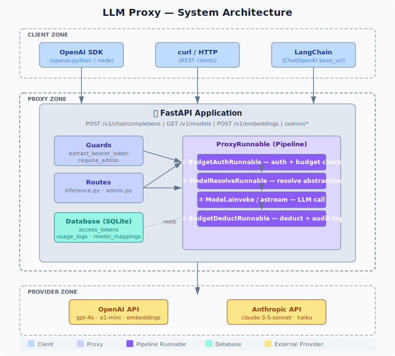
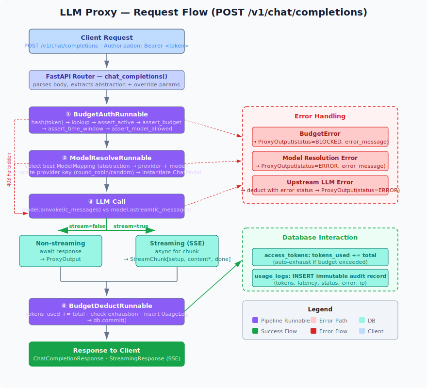

# LLM Proxy

A production-ready LLM proxy built on **FastAPI + LangChain**.





---

## Features

| Feature | Details |
|---|---|
| **Model abstractions** | `coding` `chat` `reasoning` `vision` `embedding` `summarize` |
| **Multi-provider** | OpenAI, Anthropic, Google Gemini (extensible) |
| **Multiple API keys per provider** | Round-robin, priority, or random rotation |
| **Budget types** | Fixed, time-based (daily/weekly/monthly refresh), unlimited |
| **Time-gated tokens** | `valid_from` / `valid_until` per token |
| **Per-abstraction restrictions** | Tokens can be scoped to specific model types |
| **Full audit log** | Every request logged with tokens used and latency |
| **OpenAI-compatible API** | Drop-in replacement for OpenAI chat completions |

---

## Quick start

```bash
# 1. Install dependencies
pip install -r requirements.txt

# 2. Configure environment
cp .env.example .env
# Edit .env: set SECRET_KEY, ADMIN_API_KEY

# 3. Seed the database (creates tables + example config)
python seed.py

# 4. Start the server
uvicorn main:app --reload
```

Open [http://localhost:8000/docs](http://localhost:8000/docs) for the interactive API docs.

---

## Core concepts

### Model abstractions

Clients never reference real model names — they use **abstractions**:

| Abstraction | Default backing model |
|---|---|
| `coding` | `gpt-4o` (OpenAI), fallback: `claude-3-5-sonnet` |
| `chat` | `gpt-4o-mini` |
| `reasoning` | `o1-mini` |
| `vision` | `gpt-4o` |
| `embedding` | `text-embedding-3-small` |
| `summarize` | `claude-3-haiku` |

Change the mapping any time via the admin API — **clients need no updates**.

### Access tokens

Three budget types:

```
FIXED        — total lifetime token budget (e.g. 100 000 tokens)
TIME_BASED   — budget that resets on schedule (e.g. 500 000/month)
UNLIMITED    — no cap (for internal services)
```

Tokens can also be:
- **Time-gated** — `valid_until` expires the token automatically
- **Scoped** — `allowed_models: ["chat", "coding"]` restricts which abstractions the token can use

### Provider key rotation

Multiple API keys per provider are supported.  
Register Alice's OpenAI key, Bob's OpenAI key — the proxy rotates between them.

```
KEY_ROTATION_STRATEGY=round_robin   # even distribution
KEY_ROTATION_STRATEGY=priority      # highest priority key first
KEY_ROTATION_STRATEGY=random        # random each request
```

---

## API reference

### Inference (Bearer `<proxy_token>`)

```
POST /v1/chat/completions    OpenAI-compatible chat
POST /v1/complete            Simplified single-turn
GET  /v1/models              List available abstractions
```

**Example — chat completion:**
```bash
curl -X POST http://localhost:8000/v1/chat/completions \
  -H "Authorization: Bearer llmp_your_token" \
  -H "Content-Type: application/json" \
  -d '{
    "model": "coding",
    "messages": [
      {"role": "user", "content": "Write a Python quicksort."}
    ]
  }'
```

**Example — simple complete:**
```bash
curl -X POST http://localhost:8000/v1/complete \
  -H "Authorization: Bearer llmp_your_token" \
  -H "Content-Type: application/json" \
  -d '{
    "model": "chat",
    "prompt": "Explain recursion in one paragraph.",
    "system": "You are a concise teacher."
  }'
```

### Admin (Bearer `<ADMIN_API_KEY>`)

```
POST   /admin/tokens                    Create a new access token
GET    /admin/tokens                    List all tokens
GET    /admin/tokens/{id}               Get token details
PATCH  /admin/tokens/{id}/revoke        Revoke a token
PATCH  /admin/tokens/{id}/budget        Update budget

POST   /admin/provider-keys             Register a provider API key
GET    /admin/provider-keys             List all provider keys
PATCH  /admin/provider-keys/{id}/toggle Enable/disable a key
DELETE /admin/provider-keys/{id}        Remove a key

POST   /admin/model-mappings            Create a mapping
GET    /admin/model-mappings            List all mappings
PATCH  /admin/model-mappings/{id}/toggle Enable/disable
DELETE /admin/model-mappings/{id}       Remove a mapping

GET    /admin/usage                     Audit log (filterable)
GET    /admin/usage/stats               Aggregate stats by abstraction/provider
```

**Create a monthly-budget token:**
```bash
curl -X POST http://localhost:8000/admin/tokens \
  -H "Authorization: Bearer your-admin-key" \
  -H "Content-Type: application/json" \
  -d '{
    "label": "team-frontend",
    "owner": "frontend-team",
    "budget_type": "time_based",
    "token_budget": 1000000,
    "refresh_period": "monthly",
    "allowed_models": ["chat", "coding"]
  }'
```

**Register a new provider key:**
```bash
curl -X POST http://localhost:8000/admin/provider-keys \
  -H "Authorization: Bearer your-admin-key" \
  -H "Content-Type: application/json" \
  -d '{
    "owner_label": "carol",
    "provider": "openai",
    "api_key": "sk-carol-key",
    "priority": 8
  }'
```

---

## Adding a new provider

1. Install the LangChain provider package (e.g. `langchain-mistralai`)
2. Add it to `_PROVIDER_CLASSES` in `src/services/model_registry.py`
3. Add the key param name in `_api_key_param()`
4. Register a provider key via `/admin/provider-keys`
5. Create a model mapping via `/admin/model-mappings`

---

## Architecture

```
llm-proxy/
├── main.py                        FastAPI app + lifespan
├── seed.py                        DB bootstrap
├── requirements.txt
├── .env.example
├── docs/
│   ├── architecture-overview.svg  System architecture diagram
│   └── request-flow.svg           Request pipeline flow diagram
├── config/
│   └── settings.py                Pydantic-settings config
└── src/
    ├── db/
    │   ├── models.py              SQLAlchemy ORM (AccessToken, ProviderKey, …)
    │   └── session.py             Engine, session factory
    ├── runnables/
    │   ├── proxy_graph.py         Orchestrator (ProxyRunnable — 4-step pipeline)
    │   ├── budget_auth.py         BudgetAuthRunnable — token auth + budget check
    │   ├── budget_deduct.py       BudgetDeductRunnable — deduct + audit log
    │   └── model_resolve.py       ModelResolveRunnable — resolve abstraction
    ├── services/
    │   ├── model_registry.py      ModelRegistry + key rotation (admin compat)
    │   └── budget.py              BudgetService + token hash utils (admin compat)
    ├── routes/
    │   ├── inference.py           /v1/* endpoints
    │   └── admin.py               /admin/* endpoints
    └── guards/
        └── auth.py                Bearer token extraction
```

---

## Production checklist

- [ ] Switch `DATABASE_URL` to PostgreSQL
- [ ] Set strong `SECRET_KEY` and `ADMIN_API_KEY`
- [ ] Encrypt API keys at rest (wrap `ProviderKey.api_key` with Fernet)
- [ ] Enable `REDIS_URL` for distributed rate limiting
- [ ] Put behind a reverse proxy (nginx / Caddy) with TLS
- [ ] Set `CORS_ORIGINS` to your actual frontend domains
- [ ] Add Prometheus scraping (`/metrics` via `prometheus-fastapi-instrumentator`)
